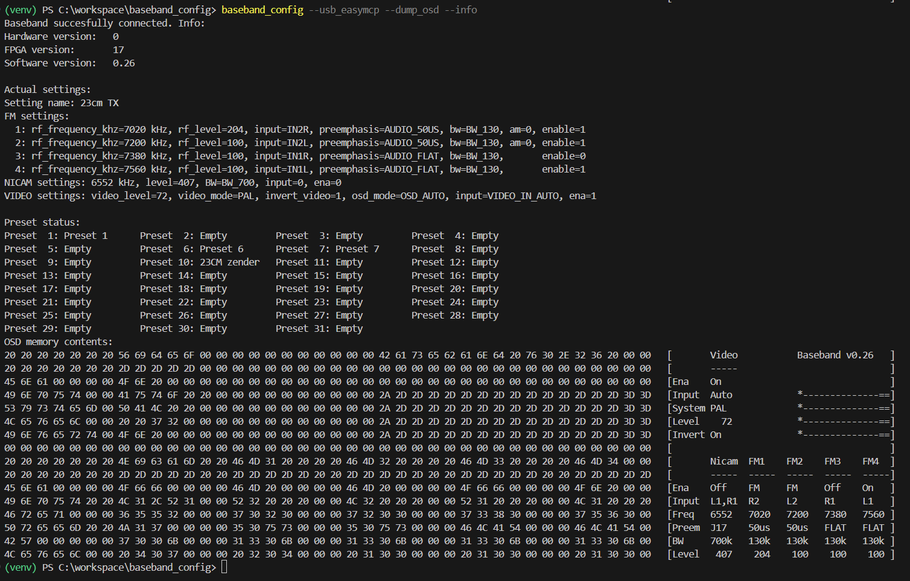

# Baseband control tool for Windows/Linux

THe PE1MUD/PE1OBW Digital Baseband is a hardware device to produce a baseband
signal for analog FM television as used by radio amateurs.
The baseband has an i2c interface which can be used to fully control it.
This tool controls the baseband from a PC using a USB<->I2C interface.
More information about the baseband can be found on <https://fm-atv.nl>.

The software presented here consists of two parts, a library `baseband` and
an example application `baseband_config`.
`Baseband_config` is a command-line program that supports export and import
of the baseband settings, read out of actual audio and video levels, upgrading
the firmware and more.

## Supported interfaces

Interfaces based on two different chips are supported.

### FTDI FT232H 

The FTDI chips do not support clock stretching. This limits the speed to
50 kHz and makes the tool unusable for some flash access commands
(although firmware upgrading works). The FT232H is the only supported 
FTDI chip that offers true open drain outputs, but other FTDI devices might
be used as well, using a workaround (diodes). See 
<https://eblot.github.io/pyftdi/installation.html> for more information. 

### Microchip MCP2221

The MCP2221A does support clock stretching, but it can leave the i2c bus in a
'hang' state when a transfer is terminated unexpectedly. I could reproduce this
by terminating the program while reading the flash contents, after that SDA
stayed low and the interface needed to be reset. This problem might be fixed
in the future...

The software supports two MCP2221 Python drivers: EasyMCP2221 and PyMCP2221A. 
EasyMCP2221A works well with the latest version (1.7.2). On my machines, it
operates reliable at 400 kHz. Overall speed is limited by the USB turnaround 
times, this is common for all chips/drivers.

The PyMCP2221A driver shows multiple issues. It works, somewhat, but it is not
recommended as firmware upgrade doesn't work yet and I've seen it leaving the
bus in a 'hang' state (SDA/SCL low forever).

## GPIO

Both the FT232H and the MCP2221A have a few GPIO pins that can be used together
with the i2c functionality. The code contains a command to pulse a GPIO pin
(active low), for example to reset the board remotely. For the FT232H, gpio's
3...6 are available, on the MCP2221A you can use GPIO0..3. On the MCP, however,
the GPIOs seem to have predefined functions; I see GPIO0 pulsing at 50 Hz after
the device is connected to the USB port...

## Installation

You need a Baseband board and a supported USB <-> I2C interface.
Connect the USB interface to the I2C header (4-pole) on the baseband PCB. For
the FT232H, wiring is as shown below:

|FT232H   |Baseband |
|---------|---------|
|GND      |GND      |
|AD0      |SCL      |
|AD1      |SDA      |
|AD2      |SDA      |
|AD7      |SCL      |

The baseband uses clock stretching, therefore both the AD0 and the AD7 line
must be connected to SCL.

For the MCP2221A, wiring is straightforward: connect SDA, SCL and GND to the
respective pins on the 4-pole Baseband I2C header.

To protect the FPGA, you could add resistors of e.g., 220 ohms in series
with SCL and SDA. Leave the +5V on the Baseband unconnected!

Then install the software:

- Install drivers (if applicable)
    - For the FT232H: follow the instructions on 
<https://eblot.github.io/pyftdi/installation.html>. For Windows, you have to 
install the 'Zadig' tool, and replace the existing driver with `libusb-win32`.
    - For the MCP2221A: under Windows, it worked out of the box for me. For Linux,
follow the instructions on 
<https://learn.adafruit.com/circuitpython-libraries-on-any-computer-with-mcp2221/linux>
- Download the codebase
- Install the tool with `pip install -e .` (the `-e` option installs the
project in 'editable' mode)
- Run the tool with `baseband_config [options]`

Examples (replace `--usb_ftdi` by `--usb_easymcp` for the MCP2221A chip):

Show all options

```bash
baseband_config --help
```

Show baseband info (version and actual settings)

```bash
baseband_config --usb_ftdi --info
```

To create a file with the settings, stored as json:

```bash
baseband_config --usb_ftdi --settings_to_file settings.json`
```

The settings file can be modified and its contents can be written back.
It is also possible to write back a partial json (i.e., only these settings
will be modified).
To write back to the baseband:

```bash
baseband_config --usb_ftdi --settings_from_file settings.json
```

To update the firmware and reboot when done:

```bash
baseband_config --usb_ftdi --upgrade baseband_0.26.bin
baseband_config --usb_ftdi --reboot
```

Change some settings:

```bash
baseband_config --usb_ftdi --set fm.0.rf_frequency_khz=7020
baseband_config --usb_ftdi --set video.video_level=100
baseband_config --usb_ftdi --set video.video_mode=PAL
baseband_config --usb_ftdi --set "name=23cm TX"
```

See the `settings.py` file for the possible fields in the settings string.

To store the actual settings to preset 10:

```bash
baseband_config --usb_ftdi --store_preset=10
```

Screenshot:

